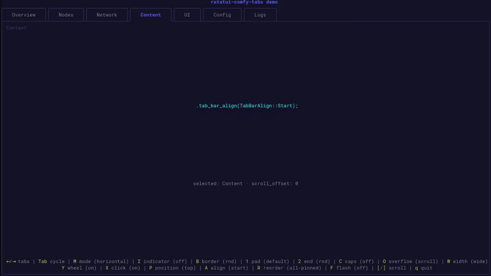

<div align="center">

# ratatui-comfy-tabs

[](https://crates.io/crates/ratatui-comfy-tabs)   
[](https://gitlab.com/comfyhome/crates/ratatui-comfy-tabs)   
[](https://github.com/comfy-home/misc-RatatuiComfyTabs)


Lightweight, customizable tab navigation for [Ratatui](https://ratatui.rs), originally made for [ComfyGit](https://github.com/comfy-home/ComfyGit): bordered, rounded-corner tabs with horizontal and vertical layouts (3 alignments for each), robust overflow handling, margin/padding handler, mouse support, and many more...
</div>

---
---

<br>

<details><summary>👀 What's new in v0.5.10 ...</summary>

### 💥 💥 💥 This Release's Top Picks ...  💥 💥 💥

#### **1. &nbsp;&nbsp;&nbsp;LIMITER for max number of displayed tabs**
- new optional argument within position declaration `.max(n)`
- you can use for example `HorizontalPosition::Top.max(5))` to cap max displayed tabs to 5
- or `VerticalPosition::Left.max(2))` to limit vertical tabs to 2
- no breaking changes, old config still works as before!
- new feature well documented
  - no GIF this time, but it should be easy to imagine...
  - however, the feature is included in the examle DEMO case (assigned shortcut `3`), feel free to try it first!


<sub>...  🎉 Enjoy!</sub>

<br><br>

<details><summary>👀 See previous changes...</summary>
<br>
<details><summary>v0-5-9 ...</summary>

#### **1. &nbsp;&nbsp;&nbsp;Full tab-bar alignment support!**
- `start`|`end`|`center`
- available in both modes `horizontal`|`vertical`
- enhanced rendering

#### **2. &nbsp;&nbsp;&nbsp;New positioning logic!**
- Horizontal mode enhanced with `Bottom` position
- Vertical with `Right`
- fully adjusted rendering to all positions

#### **3. &nbsp;&nbsp;&nbsp;Scrolling indicator overhaul!**
- Unified scroll indication
- `OverflowPolicy::Scroll` is now default
  - make sure to apply `Truncate` if it fits better your use case 

#### **4. &nbsp;&nbsp;&nbsp;Lowering minimum Rust version from 1.95 to 1.88**
- follows the current Ratatui MSRV
- compile test passes on 1.88 


<sub>...  🎉 Enjoy!</sub>

<br>
</details>
<details><summary>v0-4-4 ...</summary>

#### **1. &nbsp;&nbsp;&nbsp;Selection FLASH Indication**
- The feature is well documented + I attached a separate GIF to highlight this feature + it's in DEMO example (feel free to examine), so just a few bullet points here:
  - R-C-Tabs now can be configured to highlight/indicate newly selected tab
  - This is done by a quick (~600ms) blink
  - Color is fully customizable

#### **2. &nbsp;&nbsp;&nbsp;Tab REORDERING**
- Again, the feature is well documented, and also included in the attached GIF+DEMO, to sum it up:
  - There are 3 master configs:
    - `NonePinned`: when selected, any tab can be moved to a new position
    - `SomePinned`: when selected, you can assign a pin to a tab, it's on per-tab basis which allows you to force any tab to keep its position while non-pinned tabs can be freely reorganized!
    - `AllPinned`: I did not want to introduce breaking change, so this is the default when undeclared. AllPined = non-moveable.
  - The feature has built-in highlight for the tab that's being dragged!


<sub>...  🎉 Enjoy!</sub>

<br>
</details>
<details><summary>v0-3-4 ...</summary>

#### **1. &nbsp;&nbsp;&nbsp;Just a HOTFIX release.**
- Fixes wrong border render of the first tab when this tab is selected
- This bug affected only horizontal configuration
- SORTED!


<sub>...  🎉 Enjoy!</sub>

<br>
</details>
<details><summary>v0-3-3 ...</summary>

#### **1. &nbsp;&nbsp;&nbsp;Vertical tab rails — `TabOrientation::Vertical`, multi-line labels, and `vertical_label()` for stacked single-character rows; active tab opens toward content on the right.**
#### **2. &nbsp;&nbsp;&nbsp;Overflow that scales — `OverflowPolicy::Truncate` (default) or `Scroll` with `‹` / `›` / `…` affordances; `TabNavState::scroll_offset` drives a sliding window when tabs do not fit.**
#### **3. &nbsp;&nbsp;&nbsp;Geometry you can trust — `tab_rects()`, `tab_index_at()`, and `wheel_hover()` share the same layout math as rendering; optional `tab_widths()` / `tab_heights()` overrides fix hit-target drift (ComfyGit’s main pain point with `tui-tabs`).**
#### **4. &nbsp;&nbsp;&nbsp;Unicode-aware sizing — label width uses `unicode-width` display width (CJK and wide glyphs count correctly).**
#### **5. &nbsp;&nbsp;&nbsp;StatefulWidget + navigation — `TabNavState` with `select_direction`, `ensure_selected_visible`, `TabAxis` / `TabDirection` helpers, and keyboard-friendly scroll helpers.**
#### **6. &nbsp;&nbsp;&nbsp;Mouse input — wheel tab cycling (`handle_mouse_wheel`, touchpad axis mapping via `TabWheelDirection::from_axes`) and click-to-select (`handle_mouse_click`); both opt-out via `.mouse_wheel()` / `.mouse_click()`.**
#### **7. &nbsp;&nbsp;&nbsp;Layout polish — CSS-like `TabMargin` and `TabPadding`, `TabBarEnd` baseline caps (`NoEnd` / `Sqr` / `Rnd`), `tab_border::Rnd` or `tab_border::Sqr` via `border_set`, optional indicator, and orientation-specific defaults.**
#### **8. &nbsp;&nbsp;&nbsp;Production-ready crate — split modules (`config`, `nav`, `state`, `layout`, `render`), 44+ tests, interactive `demo` example, `ratatui-core` only (no terminal backend in the library).**

<sub>...  🎉 Enjoy!</sub>

<br>
</details>
</details>
<br>

---
<sup>... ✨ auto-injected by [ComfyGit](https://github.com/comfy-home/ComfyGit)       |       For detailed changelog [CLICK HERE](https://gitlab.com/comfyhome/crates/ratatui-comfy-tabs/-/releases/v0.5.10)</sup>

---

</details>

<br>

**Enjoying the Tabs project?** Dropping a ⭐ on our [GitHub](https://github.com/comfy-home/misc-RatatuiComfyTabs) or [GitLab](https://gitlab.com/comfyhome/crates/ratatui-comfy-tabs) repo would absolutely make our day...

**Any issues, or suggestions?** Click [HERE](https://github.com/comfy-home/misc-RatatuiComfyTabs/issues) and let us know.

---

## GIF Presentation

<div align="center">
Introduced in <code>v0.5.9</code> (GIF) :
</div>



<div align="center">
Introduced in <code>v0.4.4</code> (GIF) :
</div>


<div align="center">
Introduced in <code>v0.3.4</code> (GIF) :
</div>


---
---

## Features

- Horizontal tabs above content or vertical tabs in a left rail beside content
- Each tab renders as a bordered box with configurable corner style (rounded or square)
- Active tab opens into the adjacent content panel via junction corners
- Continuous baseline along the tab strip edge
- Optional indicator symbol on the active tab (`▸` by default for horizontal tabs)
- [`vertical_label`](https://docs.rs/ratatui-comfy-tabs/latest/ratatui_comfy_tabs/fn.vertical_label.html) helper for stacked single-character rows
- Configurable [`TabMargin`](https://docs.rs/ratatui-comfy-tabs/latest/ratatui_comfy_tabs/struct.TabMargin.html) and [`TabPadding`](https://docs.rs/ratatui-comfy-tabs/latest/ratatui_comfy_tabs/struct.TabPadding.html) with orientation-specific defaults
- [`tab_rects`](https://docs.rs/ratatui-comfy-tabs/latest/ratatui_comfy_tabs/struct.TabNav.html#method.tab_rects) for hit targets and adjacent layout without duplicating width math
- Optional per-tab size overrides via [`tab_widths`](https://docs.rs/ratatui-comfy-tabs/latest/ratatui_comfy_tabs/struct.TabNav.html#method.tab_widths) / [`tab_heights`](https://docs.rs/ratatui-comfy-tabs/latest/ratatui_comfy_tabs/struct.TabNav.html#method.tab_heights)
- [`OverflowPolicy`](https://docs.rs/ratatui-comfy-tabs/latest/ratatui_comfy_tabs/enum.OverflowPolicy.html) scroll (default) or truncate; in-tab scroll hints (`⯇` / `⯈` / `⯅` / `⯆`); truncate may show `…` on the baseline
- [`TabBarAlign`](https://docs.rs/ratatui-comfy-tabs/latest/ratatui_comfy_tabs/enum.TabBarAlign.html) start, center, or end packing along the strip
- [`HorizontalPosition`](https://docs.rs/ratatui-comfy-tabs/latest/ratatui_comfy_tabs/enum.HorizontalPosition.html) / [`VerticalPosition`](https://docs.rs/ratatui-comfy-tabs/latest/ratatui_comfy_tabs/enum.VerticalPosition.html) strip placement and open direction; optional [`.max(n)`](https://docs.rs/ratatui-comfy-tabs/latest/ratatui_comfy_tabs/enum.HorizontalPosition.html#method.max) cap on simultaneously visible tabs
- Unicode-aware label width via `unicode-width` (CJK and wide glyphs size correctly)
- [`StatefulWidget`](https://docs.rs/ratatui-comfy-tabs/latest/ratatui_comfy_tabs/struct.TabNav.html) with [`TabNavState`](https://docs.rs/ratatui-comfy-tabs/latest/ratatui_comfy_tabs/struct.TabNavState.html) and [`TabAxis`](https://docs.rs/ratatui-comfy-tabs/latest/ratatui_comfy_tabs/enum.TabAxis.html) navigation helpers
- Mouse wheel tab switching over the strip via [`TabNavState::handle_mouse_wheel`](https://docs.rs/ratatui-comfy-tabs/latest/ratatui_comfy_tabs/struct.TabNavState.html#method.handle_mouse_wheel) (enabled by default)
- Mouse click tab selection via [`TabNavState::handle_mouse_click`](https://docs.rs/ratatui-comfy-tabs/latest/ratatui_comfy_tabs/struct.TabNavState.html#method.handle_mouse_click) (enabled by default)
- Optional drag reorder via [`TabReorderPolicy`](https://docs.rs/ratatui-comfy-tabs/latest/ratatui_comfy_tabs/enum.TabReorderPolicy.html) and mouse handlers; dragged tab highlighted in **indexed fg 46** after drag starts (not on click alone)
- Selection border flash (two pulses, **indexed fg 46** by default) when the active tab changes — borders only, not the label
- Depends on `ratatui-core` only — no terminal backend required in library code

## Installation

```bash
cargo add ratatui-comfy-tabs
```

Or add it manually to your `Cargo.toml`:

```toml
[dependencies]
ratatui-comfy-tabs = "0.5"
ratatui = "0.30"
```

## Usage

### Crate Roadmap

<details>
<summary>Click Here to view</summary>

```
ratatui-comfy-tabs
│
├── REQUIRED ─────────────────────────────────────────────────────────────
│   │
│   ├── TabNav::new(labels, selected)
│   │     ├── labels: &[&str]          (one label per tab; \n for vertical stacks)
│   │     └── selected: usize          (active tab index; caller-owned)
│   │
│   ├── Render area: Rect
│   │     ├── Horizontal → height ≥ strip height (default 3 rows)
│   │     └── Vertical   → width  ≥ rail width  (≥ 3 cols + padding)
│   │
│   └── Selection ownership (pick one)
│         ├── Stateless → pass selected into TabNav::new each frame
│         └── Stateful  → TabNavState { selected, … } + StatefulWidget::render
│
└── OPTIONAL ─────────────────────────────────────────────────────────────
    │
    ├── TabNav builder (all have sensible defaults)
    │   ├── orientation()          Horizontal | Vertical
    │   ├── horizontal_position()  Top | Bottom
    │   ├── vertical_position()    Left | Right
    │   ├── tab_bar_align()        Start | Center | End
    │   ├── margin()               TabMargin (strip inset on flow axis)
    │   ├── padding()              TabPadding (interior tab box spacing)
    │   ├── tab_bar_end()          NoEnd | Sqr | Rnd
    │   ├── all_caps()             bool
    │   ├── style()                inactive label Style
    │   ├── highlight_style()      active label Style
    │   ├── highlight_bold()       bool (default true)
    │   ├── border_style()         border + baseline Style
    │   ├── indicator()            Option<&str>  (▸ horizontal default; none vertical)
    │   ├── border_set()           Rnd | Sqr
    │   ├── tab_widths() / tab_heights()   per-tab size overrides
    │   ├── overflow()             Scroll | Truncate
    │   ├── scroll_offset()        usize (stateless Scroll mode only)
    │   ├── overflow_affordance()  bool — truncate `…` on baseline (default true)
    │   ├── mouse_wheel()          bool (default true; app must forward events)
    │   ├── mouse_click()          bool (default true; app must forward events)
    │   ├── reorder_policy()       AllPinned | NonePinned | SomePinned
    │   ├── tab_pinned()           &[bool] for SomePinned
    │   ├── mouse_reorder()        bool (default false; app must forward drag events)
    │   └── reorder_drag_style()   Style (default fg indexed **46** while dragging)
    │
    ├── TabNavState (when using StatefulWidget or input helpers)
    │   ├── scroll_offset          usize (meaningful when overflow = Scroll)
    │   ├── select() / select_direction() / select_direction_wrapping()
    │   ├── scroll_prev() / scroll_next()
    │   ├── ensure_selected_visible()
    │   ├── select_direction_visible() / select_direction_wrapping_visible()
    │   ├── handle_mouse_wheel()   needs strip Rect + pointer + TabWheelDirection
    │   ├── handle_mouse_click()   needs strip Rect + pointer
    │   ├── handle_mouse_reorder_*  press / drag / release (StatefulWidget render shows drag highlight)
    │   └── reorder_drag           in state during drag (drives indexed-46 highlight)
    │
    ├── Geometry / hit-test API (read-only helpers)
    │   ├── tab_rects() / tab_rects_with_scroll()
    │   ├── tab_index_at()
    │   ├── wheel_hover()
    │   ├── auto_tab_width() / auto_tab_height()
    │   ├── horizontal_strip_height()
    │   └── vertical_rail_width()
    │
    ├── Input mapping types
    │   ├── TabDirection             Previous | Next
    │   ├── TabAxis                  Decrease | Increase  → TabDirection
    │   └── TabWheelDirection        Up | Down  + from_axes(vertical, horizontal, orientation)
    │
    └── Utilities
          └── vertical_label(text)   → stacked "\n"-separated chars for vertical rails
```

</details>

### Horizontal tabs

```rust
use ratatui::style::{Color, Style};
use ratatui_comfy_tabs::TabNav;

let widget = TabNav::new(&["Files", "Search", "Settings"], 0)
    .highlight_style(Style::new().fg(Color::Cyan))
    .border_style(Style::new().fg(Color::DarkGray));
```

Requires exactly **3 rows** of height (top border, label row, baseline).

### Vertical tabs

```rust
use ratatui::style::{Color, Style};
use ratatui_comfy_tabs::{TabNav, TabOrientation, vertical_label};

let labels: Vec<String> = ["Files", "Search", "Settings"]
    .into_iter()
    .map(vertical_label)
    .collect();
let refs: Vec<&str> = labels.iter().map(String::as_str).collect();

let widget = TabNav::new(&refs, 0)
    .orientation(TabOrientation::Vertical)
    .highlight_style(Style::new().fg(Color::Cyan))
    .border_style(Style::new().fg(Color::DarkGray));
```

Requires at least **3 columns** of width. The indicator is **off by default** for vertical tabs; pass `.indicator(Some("▸"))` to enable.

Labels may contain `\n` for multi-line stacked text, or use [`vertical_label`](https://docs.rs/ratatui-comfy-tabs/latest/ratatui_comfy_tabs/fn.vertical_label.html) to rotate a string.

## Builder Methods

| Method | Default | Description |
|--------|---------|-------------|
| `orientation()` | `Horizontal` | `Horizontal` or `Vertical` tab strip |
| `horizontal_position()` | `Top` | `Top` / `Bottom`; pass `.max(n)` to cap visible tabs |
| `vertical_position()` | `Left` | `Left` / `Right`; pass `.max(n)` to cap visible tabs |
| `tab_bar_align()` | `Start` | Pack tabs at start, center, or end of strip |
| `margin()` | orientation-specific | Strip inset — see [Margin](#margin) |
| `padding()` | orientation-specific | Interior tab spacing — see [Padding](#padding) |
| `tab_bar_end()` | `NoEnd` | Baseline end caps — see [Tab bar end](#tab-bar-end) |
| `all_caps()` | `false` | Render tab labels in uppercase |
| `style()` | Unstyled | Inactive tab label style |
| `highlight_style()` | Unstyled | Active tab label style |
| `highlight_bold()` | `true` | Auto-apply bold to active tab |
| `border_style()` | Unstyled | Border and baseline style |
| `indicator()` | `Some("▸")` horizontal / `None` vertical | Active-tab marker; pass `None` to disable |
| `border_set()` | `tab_border::Rnd` | Border character set — [`tab_border::Rnd`] or [`tab_border::Sqr`] |
| `tab_widths()` | auto | Override horizontal tab widths (columns) |
| `tab_heights()` | auto | Override vertical tab heights (rows) |
| `tab_rects(area)` | — | Layout `Rect` per visible tab (for hit targets) |
| `overflow()` | `Scroll` | `Scroll` (default) or `Truncate` when tabs exceed space |
| `scroll_offset()` | `0` | First visible tab for stateless scroll mode |
| `overflow_affordance()` | `true` | Truncate mode: `…` at clipped baseline edge |
| `mouse_wheel()` | `true` | Allow wheel tab switching over the strip |
| `mouse_click()` | `true` | Allow click tab selection on visible tabs |
| `reorder_policy()` | `AllPinned` | `NonePinned` / `SomePinned` drag reorder — see [Tab reordering](#tab-reordering) |
| `tab_pinned()` | — | Per-tab pin flags when policy is `SomePinned` |
| `mouse_reorder()` | `false` | Enable drag reorder (app forwards press/drag/release) |
| `reorder_drag_style()` | fg **46** | Label and border style while dragging (after first drag event) |
| `selection_flash()` | `true` | Border pulse when selection changes |
| `selection_flash_style()` | fg **46** | Border-only flash color |
| `auto_tab_width()` / `auto_tab_height()` | — | Default size for one tab index |
| `horizontal_strip_height()` | — | Minimum render height for horizontal layout |
| `vertical_rail_width()` | — | Rail width for vertical layout (widest tab) |

### Margin

CSS-like inset for the tab strip along the flow axis:

| Orientation | Axes                  | Default | Example                                |
| -------------| -----------------------| ---------| ----------------------------------------|
| Horizontal  | left, right (columns) | `0 0`   | `.margin(TabMargin::horizontal(2, 0))` |
| Vertical    | top, bottom (rows)    | `0 0`   | `.margin(TabMargin::vertical(0, 2))`   |

Both orientations default to [`TabMargin::ZERO`].

### Padding

CSS-like `padding: top bottom left right` inside each tab box (top/bottom = rows, left/right = columns):

| Orientation | Default | Meaning |
|-------------|---------|---------|
| Horizontal | `0 0 3 3` | Three columns each side of the label; label on the middle row |
| Vertical | `1 1 1 1` | One row/column of space between border and label |

```rust
use ratatui_comfy_tabs::{TabNav, TabPadding, TabMargin};

TabNav::new(&["Files", "Search"], 0)
    .margin(TabMargin::horizontal(1, 1))
    .padding(TabPadding::new(0, 0, 2, 2));
```

Use [`TabPadding::axes`] for CSS two-value padding (`padding: 1 1` → top/bottom 1, left/right 1).

### Tab bar end

[`TabBarEnd`](https://docs.rs/ratatui-comfy-tabs/latest/ratatui_comfy_tabs/enum.TabBarEnd.html) styles the baseline end caps:

| Mode    | Horizontal baseline                                          | Vertical rail                     |
| ---------| --------------------------------------------------------------| -----------------------------------|
| `NoEnd` | continuous `─`                                               | continuous `│`                    |
| `Sqr`   | `├` … `┐` (`│` … `┐` when the first visible tab is selected) | first tab top `┬`/`─`, bottom `└` |
| `Rnd`   | `├` … `╮` (`│` … `╮` when the first visible tab is selected) | first tab top `┬`/`─`, bottom `╰` |

```rust
use ratatui_comfy_tabs::{TabNav, TabBarEnd};

TabNav::new(&["A", "B"], 0).tab_bar_end(TabBarEnd::Rnd);
```

### Border style

[`tab_border::Rnd`](https://docs.rs/ratatui-comfy-tabs/latest/ratatui_comfy_tabs/tab_border/constant.Rnd.html) and [`tab_border::Sqr`](https://docs.rs/ratatui-comfy-tabs/latest/ratatui_comfy_tabs/tab_border/constant.Sqr.html) are aliases for Ratatui's `symbols::border::ROUNDED` and `PLAIN`:

```rust
use ratatui_comfy_tabs::{TabNav, tab_border};

TabNav::new(&["A", "B"], 0).border_set(tab_border::Sqr);
```

### Tab sizing and geometry

Default horizontal tab **width** (columns):

`2 + padding.left + label_display_width + padding.right`

Default vertical tab **height** (rows):

`2 + padding.top + label_line_count + padding.bottom`

Label width uses Unicode **display width** ([`unicode-width`](https://docs.rs/unicode-width)). Use [`auto_tab_width`](https://docs.rs/ratatui-comfy-tabs/latest/ratatui_comfy_tabs/struct.TabNav.html#method.auto_tab_width) / [`auto_tab_height`](https://docs.rs/ratatui-comfy-tabs/latest/ratatui_comfy_tabs/struct.TabNav.html#method.auto_tab_height) to query sizes for a configured widget.

Override per-tab sizes when auto layout does not match your UI (e.g. mouse hit targets):

```rust
use ratatui::layout::Rect;
use ratatui_comfy_tabs::TabNav;

let nav = TabNav::new(&["Files", "Search", "Settings"], 0)
    .tab_widths(&[16, 22, 20]);

for rect in nav.tab_rects(Rect::new(0, 0, 80, 3)) {
    // use rect for click handling or adjacent layout
}
```

[`tab_rects`](https://docs.rs/ratatui-comfy-tabs/latest/ratatui_comfy_tabs/struct.TabNav.html#method.tab_rects) returns one rectangle per tab that fits in `area`, using the same truncation or scroll rules as rendering. For vertical tabs, pass explicit heights with `.tab_heights(&[…])`.

### Overflow and scrolling

When tabs exceed strip space:

| Policy | Behaviour |
|--------|-----------|
| `OverflowPolicy::Scroll` (default) | Sliding window from [`TabNavState::scroll_offset`](https://docs.rs/ratatui-comfy-tabs/latest/ratatui_comfy_tabs/struct.TabNavState.html#structfield.scroll_offset); `⯇` / `⯈` (horizontal) or `⯅` / `⯆` (vertical) on the first/last visible tab when more tabs exist off-screen — no extra baseline columns |
| `OverflowPolicy::Truncate` | Show tabs from the start; hidden tabs omitted; optional `…` at the clipped baseline edge |

```rust
use ratatui::layout::Rect;
use ratatui_comfy_tabs::{OverflowPolicy, TabNav, TabNavState, TabDirection};
use ratatui_core::widgets::StatefulWidget;

let nav = TabNav::new(&["A", "B", "C", "D", "E"], 0); // Scroll by default
let mut state = TabNavState::new(4);
state.ensure_selected_visible(&nav, Rect::new(0, 0, 24, 3));
// render with StatefulWidget::render(nav, area, buf, &mut state);
state.select_direction(TabDirection::Previous, 5);
```

Use `.overflow(OverflowPolicy::Truncate)` when you prefer omitted tabs over a scroll window.

### Position max cap

Limit how many tabs appear at once regardless of available strip space. Hidden tabs are reached via [`TabNavState::scroll_offset`](https://docs.rs/ratatui-comfy-tabs/latest/ratatui_comfy_tabs/struct.TabNavState.html#structfield.scroll_offset) (scroll mode) or keyboard/wheel navigation with [`ensure_selected_visible`](https://docs.rs/ratatui-comfy-tabs/latest/ratatui_comfy_tabs/struct.TabNavState.html#method.ensure_selected_visible):

```rust
use ratatui_comfy_tabs::{HorizontalPosition, TabNav, TabOrientation, VerticalPosition};

// Horizontal: at most five tabs visible (default Top syntax unchanged)
TabNav::new(&labels, 0).horizontal_position(HorizontalPosition::Top.max(5));

// Vertical: at most two tabs visible
TabNav::new(&labels, 0)
    .orientation(TabOrientation::Vertical)
    .vertical_position(VerticalPosition::Left.max(2));

// No cap — existing API unchanged
TabNav::new(&labels, 0).horizontal_position(HorizontalPosition::Top);
```

When a max is set and total tabs exceed it, the widget uses scroll-window semantics even if physical space could fit more tabs.

Use [`TabAxis::Decrease`](https://docs.rs/ratatui-comfy-tabs/latest/ratatui_comfy_tabs/enum.TabAxis.html) / [`TabAxis::Increase`](https://docs.rs/ratatui-comfy-tabs/latest/ratatui_comfy_tabs/enum.TabAxis.html) to map arrow keys by orientation (`Decrease` → previous tab, `Increase` → next).

### Mouse wheel

When [`.mouse_wheel(true)`](https://docs.rs/ratatui-comfy-tabs/latest/ratatui_comfy_tabs/struct.TabNav.html#method.mouse_wheel) (default), forward scroll events to [`TabNavState::handle_mouse_wheel`](https://docs.rs/ratatui-comfy-tabs/latest/ratatui_comfy_tabs/struct.TabNavState.html#method.handle_mouse_wheel) while the pointer is over the strip or any visible tab ([`TabNav::wheel_hover`](https://docs.rs/ratatui-comfy-tabs/latest/ratatui_comfy_tabs/struct.TabNav.html#method.wheel_hover)):

```rust
use ratatui::crossterm::event::{MouseEventKind, Event};
use ratatui_comfy_tabs::{TabNav, TabNavState, TabOrientation, TabWheelDirection};

// Map crossterm scroll kinds; horizontal strips prefer touchpad left/right.
let vertical = match mouse.kind {
    MouseEventKind::ScrollUp => Some(TabWheelDirection::Up),
    MouseEventKind::ScrollDown => Some(TabWheelDirection::Down),
    _ => None,
};
let horizontal = match mouse.kind {
    MouseEventKind::ScrollLeft => Some(TabWheelDirection::Up),
    MouseEventKind::ScrollRight => Some(TabWheelDirection::Down),
    _ => None,
};
if let Some(direction) =
    TabWheelDirection::from_axes(vertical, horizontal, TabOrientation::Horizontal)
{
    // Terminals emit many wheel events per notch — coalesce bursts in your loop
    // so one physical scroll moves one tab (see `examples/demo.rs`).
    state.handle_mouse_wheel(&nav, strip_area, mouse.column, mouse.row, direction);
}
```

Pass the full layout strip [`Rect`](https://docs.rs/ratatui-core/latest/ratatui_core/layout/struct.Rect.html) as `strip_area` even when the widget renders into a narrower viewport. Returns `true` when consumed. Disable per widget with `.mouse_wheel(false)`.

### Mouse click

When [`.mouse_click(true)`](https://docs.rs/ratatui-comfy-tabs/latest/ratatui_comfy_tabs/struct.TabNav.html#method.mouse_click) (default), forward left-click events to [`TabNavState::handle_mouse_click`](https://docs.rs/ratatui-comfy-tabs/latest/ratatui_comfy_tabs/struct.TabNavState.html#method.handle_mouse_click). Pass the same `area` used to render the tab strip:

```rust
if mouse.kind == MouseEventKind::Down(MouseButton::Left) {
    state.handle_mouse_click(&nav, tab_area, mouse.column, mouse.row);
}
```

Use [`TabNav::tab_index_at`](https://docs.rs/ratatui-comfy-tabs/latest/ratatui_comfy_tabs/struct.TabNav.html#method.tab_index_at) when you need the hit target without changing selection. Disable with `.mouse_click(false)`.

### Tab reordering

Drag-and-drop reorder with optional **pinned** tabs. Default policy **`AllPinned`** keeps legacy fixed order (no drag).

| Policy | Behaviour |
|--------|-----------|
| `AllPinned` (default) | No reordering |
| `NonePinned` | Every tab may move |
| `SomePinned` | `tab_pinned[i] == true` → fixed slot; others reorder among unpinned indices |

```rust
use ratatui::layout::Rect;
use ratatui::style::{Color, Style};
use ratatui_comfy_tabs::{
    TabNav, TabNavState, TabReorderPolicy, try_reorder, remap_selected_index,
};
use ratatui_core::widgets::StatefulWidget;

let pinned = [true, false, false]; // first tab fixed
let nav = TabNav::new(&labels, selected)
    .reorder_policy(TabReorderPolicy::SomePinned)
    .tab_pinned(&pinned)
    .mouse_reorder(true)
    .reorder_drag_style(Style::new().fg(Color::Indexed(46))); // optional; 46 is the default

let mut state = TabNavState::new(selected);
// StatefulWidget::render(nav, area, buf, &mut state) — highlights drag.source in fg 46

if state.handle_mouse_reorder_press(&nav, strip_area, col, row) {
    // drag started
}
state.handle_mouse_reorder_drag(&nav, strip_area, col, row);
if let Some(reorder) = state.handle_mouse_reorder_release(&nav) {
    let _ = try_reorder(&mut tab_order, reorder.from, reorder.to, TabReorderPolicy::SomePinned, Some(&pinned));
    state.selected = remap_selected_index(state.selected, reorder.from, reorder.to);
}
```

After the first mouse **drag** event while reordering, the tab at `source` is drawn with [`.reorder_drag_style`](https://docs.rs/ratatui-comfy-tabs/latest/ratatui_comfy_tabs/struct.TabNav.html#method.reorder_drag_style) (default **foreground indexed color 46** on label and borders). A click without movement does not show drag highlight.

### Selection flash

When the selected tab changes (keyboard, mouse click, wheel, or reorder remap), the new tab’s **border** pulses twice in [`.selection_flash_style`](https://docs.rs/ratatui-comfy-tabs/latest/ratatui_comfy_tabs/struct.TabNav.html#method.selection_flash_style) (default indexed **46**). Labels keep their normal active/inactive styles. Disable with `.selection_flash(false)`.

```rust
TabNav::new(&labels, selected)
    .selection_flash_style(Style::new().fg(Color::Indexed(46))); // optional — 46 is the default
// StatefulWidget::render(nav, area, buf, &mut state)
// While state.selection_flash_active(), keep redrawing (~50 ms poll) so both blinks show
```

### Crate layout

| Module | Role |
|--------|------|
| `config` | Margin, padding, orientation, overflow, direction types |
| `nav` | [`TabNav`](https://docs.rs/ratatui-comfy-tabs/latest/ratatui_comfy_tabs/struct.TabNav.html) builder and geometry API |
| `state` | [`TabNavState`](https://docs.rs/ratatui-comfy-tabs/latest/ratatui_comfy_tabs/struct.TabNavState.html) selection, scroll, and input helpers |
| `layout` | Sizing and viewport math (internal) |
| `render` | Widget drawing (internal) |
| `label` | [`vertical_label`](https://docs.rs/ratatui-comfy-tabs/latest/ratatui_comfy_tabs/fn.vertical_label.html) helper |

## Demo

1. `git clone` the repo
2. `cd` into it
3. and run...

```bash
cargo run --example demo
```

| Key                | Action                                                     |
| --------------------| ------------------------------------------------------------|
| `h` / `l` or ← / → | Previous / next tab (horizontal mode)                      |
| `j` / `k` or ↑ / ↓ | Previous / next tab (vertical mode)                        |
| `Tab` / `BackTab`  | Cycle tabs                                                 |
| `M`                | Toggle horizontal / vertical mode                          |
| `I`                | Toggle active-tab indicator                                |
| `B`                | Toggle `tab_border::Rnd` / `Sqr` borders                   |
| `1`                | Cycle padding preset (`default` / alt presets)             |
| `P`                | Cycle horizontal/vertical position and tab bar alignment   |
| `2`                | Cycle tab bar end (`none` / `sqr` / `rnd`)                 |
| `3`                | Toggle position max cap (horizontal **5**, vertical **2**) |
| `C`                | Toggle all-caps tab labels                                 |
| `O`                | Toggle overflow (`truncate` / `scroll`)                    |
| `W`                | Toggle narrow tab strip (forces overflow)                  |
| `Y`                | Toggle mouse wheel tab switching                           |
| `X`                | Toggle mouse click tab selection                           |
| `P`                | Cycle reorder policy (`all` / `none` / `some` pinned)      |
| `[` / `]`          | Scroll tab window (scroll mode)                            |
| Drag tab           | Reorder when policy allows (Overview pinned in `some`)     |
| Scroll wheel       | Previous / next tab while hovering tabs                    |
| Left click         | Select tab under pointer                                   |
| `q` / `Esc`        | Quit                                                       |

---


## License & Attribution

Version 0.1.0 and above is licensed under the Ratatui-Comfy-Tabs Project License — **SA-PS:DA** (Source-Available Public Software with Distribution Allowed).  

See [LICENSE.md](LICENSE.md).

><sup> **Attribution**: Originally based on 350 lines of code from `tui-tabs v0.0.1` by [jharsono](https://github.com/jharsono), therefore, v0.0.1 inherits its license (MIT). Lineage and upstream references are recorded in `Cargo.toml` under `[package.metadata]`.</sup>

## Contribution

See [CONTRIBUTING.md](CONTRIBUTING.md).

<p align="center">
  <sub>Made with ❤️ by <a href="https://comfyhome.io">ComfyHome™</a></sub>
</p>