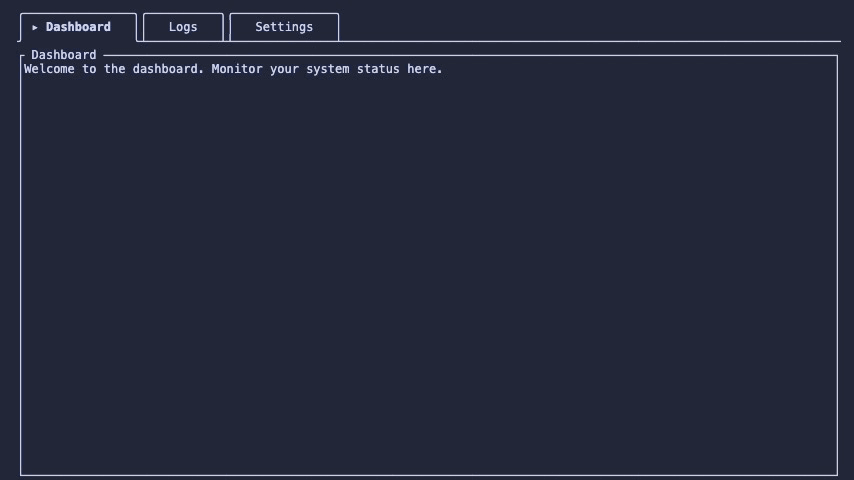

# ratatui-comfy-tabs

An advanced tab navigation widget for [Ratatui](https://ratatui.rs) with individually bordered boxes and rounded corners.



## Features

- Horizontal tabs above content or vertical tabs in a left rail beside content
- Each tab renders as a bordered box with configurable corner style (rounded or square)
- Active tab opens into the adjacent content panel via junction corners
- Continuous baseline along the tab strip edge
- Optional indicator symbol on the active tab (`▸` by default for horizontal tabs)
- [`vertical_label`](https://docs.rs/ratatui-comfy-tabs/latest/ratatui_comfy_tabs/fn.vertical_label.html) helper for stacked single-character rows
- Configurable [`TabMargin`](https://docs.rs/ratatui-comfy-tabs/latest/ratatui_comfy_tabs/struct.TabMargin.html) and [`TabPadding`](https://docs.rs/ratatui-comfy-tabs/latest/ratatui_comfy_tabs/struct.TabPadding.html) with orientation-specific defaults
- [`tab_rects`](https://docs.rs/ratatui-comfy-tabs/latest/ratatui_comfy_tabs/struct.TabNav.html#method.tab_rects) for hit targets and adjacent layout without duplicating width math
- Optional per-tab size overrides via [`tab_widths`](https://docs.rs/ratatui-comfy-tabs/latest/ratatui_comfy_tabs/struct.TabNav.html#method.tab_widths) / [`tab_heights`](https://docs.rs/ratatui-comfy-tabs/latest/ratatui_comfy_tabs/struct.TabNav.html#method.tab_heights)
- [`OverflowPolicy`](https://docs.rs/ratatui-comfy-tabs/latest/ratatui_comfy_tabs/enum.OverflowPolicy.html) truncate or scroll with edge affordances (`‹` / `›` / `…`)
- Unicode-aware label width via `unicode-width` (CJK and wide glyphs size correctly)
- [`StatefulWidget`](https://docs.rs/ratatui-comfy-tabs/latest/ratatui_comfy_tabs/struct.TabNav.html) with [`TabNavState`](https://docs.rs/ratatui-comfy-tabs/latest/ratatui_comfy_tabs/struct.TabNavState.html) and [`TabAxis`](https://docs.rs/ratatui-comfy-tabs/latest/ratatui_comfy_tabs/enum.TabAxis.html) navigation helpers
- Depends on `ratatui-core` only — no terminal backend required in library code

## Installation

```bash
cargo add ratatui-comfy-tabs
```

Or add it manually to your `Cargo.toml`:

```toml
[dependencies]
ratatui-comfy-tabs = "0.3"
ratatui = "0.30"
```

## Usage

### Horizontal tabs

```rust
use ratatui::style::{Color, Style};
use ratatui_comfy_tabs::TabNav;

let widget = TabNav::new(&["Files", "Search", "Settings"], 0)
    .highlight_style(Style::new().fg(Color::Cyan))
    .border_style(Style::new().fg(Color::DarkGray));
```

Requires exactly **3 rows** of height (top border, label row, baseline).

### Vertical tabs

```rust
use ratatui::style::{Color, Style};
use ratatui_comfy_tabs::{TabNav, TabOrientation, vertical_label};

let labels: Vec<String> = ["Files", "Search", "Settings"]
    .into_iter()
    .map(vertical_label)
    .collect();
let refs: Vec<&str> = labels.iter().map(String::as_str).collect();

let widget = TabNav::new(&refs, 0)
    .orientation(TabOrientation::Vertical)
    .highlight_style(Style::new().fg(Color::Cyan))
    .border_style(Style::new().fg(Color::DarkGray));
```

Requires at least **3 columns** of width. The indicator is **off by default** for vertical tabs; pass `.indicator(Some("▸"))` to enable.

Labels may contain `\n` for multi-line stacked text, or use [`vertical_label`](https://docs.rs/ratatui-comfy-tabs/latest/ratatui_comfy_tabs/fn.vertical_label.html) to rotate a string.

## Builder Methods

| Method | Default | Description |
|--------|---------|-------------|
| `orientation()` | `Horizontal` | `Horizontal` or `Vertical` tab strip |
| `margin()` | orientation-specific | Strip inset — see [Margin](#margin) |
| `padding()` | orientation-specific | Interior tab spacing — see [Padding](#padding) |
| `tab_bar_end()` | `NoEnd` | Baseline end caps — see [Tab bar end](#tab-bar-end) |
| `all_caps()` | `false` | Render tab labels in uppercase |
| `style()` | Unstyled | Inactive tab label style |
| `highlight_style()` | Unstyled | Active tab label style |
| `highlight_bold()` | `true` | Auto-apply bold to active tab |
| `border_style()` | Unstyled | Border and baseline style |
| `indicator()` | `Some("▸")` horizontal / `None` vertical | Active-tab marker; pass `None` to disable |
| `border_set()` | `ROUNDED` | Border character set (`ROUNDED`, `PLAIN`, etc.) |
| `tab_widths()` | auto | Override horizontal tab widths (columns) |
| `tab_heights()` | auto | Override vertical tab heights (rows) |
| `tab_rects(area)` | — | Layout `Rect` per visible tab (for hit targets) |
| `overflow()` | `Truncate` | `Truncate` or `Scroll` when tabs exceed space |
| `scroll_offset()` | `0` | First visible tab for stateless scroll mode |
| `overflow_affordance()` | `true` | `‹` / `›` / `…` at clipped edges |
| `auto_tab_width()` / `auto_tab_height()` | — | Default size for one tab index |
| `horizontal_strip_height()` | — | Minimum render height for horizontal layout |
| `vertical_rail_width()` | — | Rail width for vertical layout (widest tab) |

### Margin

CSS-like inset for the tab strip along the flow axis:

| Orientation | Axes                  | Default | Example                                |
| -------------| -----------------------| ---------| ----------------------------------------|
| Horizontal  | left, right (columns) | `0 0`   | `.margin(TabMargin::horizontal(2, 0))` |
| Vertical    | top, bottom (rows)    | `0 0`   | `.margin(TabMargin::vertical(0, 2))`   |

Both orientations default to [`TabMargin::ZERO`].

### Padding

CSS-like `padding: top bottom left right` inside each tab box (top/bottom = rows, left/right = columns):

| Orientation | Default | Meaning |
|-------------|---------|---------|
| Horizontal | `0 0 3 3` | Three columns each side of the label; label on the middle row |
| Vertical | `1 1 1 1` | One row/column of space between border and label |

```rust
use ratatui_comfy_tabs::{TabNav, TabPadding, TabMargin};

TabNav::new(&["Files", "Search"], 0)
    .margin(TabMargin::horizontal(1, 1))
    .padding(TabPadding::new(0, 0, 2, 2));
```

Use [`TabPadding::axes`] for CSS two-value padding (`padding: 1 1` → top/bottom 1, left/right 1).

### Tab bar end

[`TabBarEnd`](https://docs.rs/ratatui-comfy-tabs/latest/ratatui_comfy_tabs/enum.TabBarEnd.html) styles the baseline end caps:

| Mode | Horizontal baseline | Vertical rail |
|------|---------------------|---------------|
| `NoEnd` | continuous `─` | continuous `│` |
| `Angl` | `├` … `┐` | first tab top `┬`/`─`, bottom `└` |
| `Rnd` | `├` … `╮` | first tab top `┬`/`─`, bottom `╰` |

```rust
use ratatui_comfy_tabs::{TabNav, TabBarEnd};

TabNav::new(&["A", "B"], 0).tab_bar_end(TabBarEnd::Rnd);
```

### Tab sizing and geometry

Default horizontal tab **width** (columns):

`2 + padding.left + label_display_width + padding.right`

Default vertical tab **height** (rows):

`2 + padding.top + label_line_count + padding.bottom`

Label width uses Unicode **display width** ([`unicode-width`](https://docs.rs/unicode-width)). Use [`auto_tab_width`](https://docs.rs/ratatui-comfy-tabs/latest/ratatui_comfy_tabs/struct.TabNav.html#method.auto_tab_width) / [`auto_tab_height`](https://docs.rs/ratatui-comfy-tabs/latest/ratatui_comfy_tabs/struct.TabNav.html#method.auto_tab_height) to query sizes for a configured widget.

Override per-tab sizes when auto layout does not match your UI (e.g. mouse hit targets):

```rust
use ratatui::layout::Rect;
use ratatui_comfy_tabs::TabNav;

let nav = TabNav::new(&["Files", "Search", "Settings"], 0)
    .tab_widths(&[16, 22, 20]);

for rect in nav.tab_rects(Rect::new(0, 0, 80, 3)) {
    // use rect for click handling or adjacent layout
}
```

[`tab_rects`](https://docs.rs/ratatui-comfy-tabs/latest/ratatui_comfy_tabs/struct.TabNav.html#method.tab_rects) returns one rectangle per tab that fits in `area`, using the same truncation or scroll rules as rendering. For vertical tabs, pass explicit heights with `.tab_heights(&[…])`.

### Overflow and scrolling

When tabs exceed strip space:

| Policy | Behaviour |
|--------|-----------|
| `OverflowPolicy::Truncate` (default) | Show tabs from the start; hidden tabs omitted; `…` at the clipped edge |
| `OverflowPolicy::Scroll` | Sliding window from [`TabNavState::scroll_offset`](https://docs.rs/ratatui-comfy-tabs/latest/ratatui_comfy_tabs/struct.TabNavState.html#structfield.scroll_offset); `‹` / `›` when more tabs exist off-screen |

```rust
use ratatui::layout::Rect;
use ratatui_comfy_tabs::{OverflowPolicy, TabNav, TabNavState, TabDirection};
use ratatui_core::widgets::StatefulWidget;

let nav = TabNav::new(&["A", "B", "C", "D", "E"], 0).overflow(OverflowPolicy::Scroll);
let mut state = TabNavState::new(4);
state.ensure_selected_visible(&nav, Rect::new(0, 0, 24, 3));
// render with StatefulWidget::render(nav, area, buf, &mut state);
state.select_direction(TabDirection::Previous, 5);
```

Use [`TabAxis::Decrease`](https://docs.rs/ratatui-comfy-tabs/latest/ratatui_comfy_tabs/enum.TabAxis.html) / [`TabAxis::Increase`](https://docs.rs/ratatui-comfy-tabs/latest/ratatui_comfy_tabs/enum.TabAxis.html) to map arrow keys by orientation (`Decrease` → previous tab, `Increase` → next).

## Demo

```bash
cargo run --example demo
```

| Key | Action |
|-----|--------|
| `h` / `l` or ← / → | Previous / next tab (horizontal mode) |
| `j` / `k` or ↑ / ↓ | Previous / next tab (vertical mode) |
| `Tab` / `BackTab` | Cycle tabs |
| `M` | Toggle horizontal / vertical mode |
| `I` | Toggle active-tab indicator |
| `B` | Toggle rounded / square borders |
| `1` | Cycle padding preset (`default` / alt presets) |
| `2` | Cycle tab bar end (`none` / `angl` / `rnd`) |
| `C` | Toggle all-caps tab labels |
| `O` | Toggle overflow (`truncate` / `scroll`) |
| `W` | Toggle narrow tab strip (forces overflow) |
| `[` / `]` | Scroll tab window (scroll mode) |
| `q` / `Esc` | Quit |

Run `cargo run --example demo` for the interactive showcase.

## License

Version 0.1.0 and above is licensed under the Ratatui-Comfy-Tabs Project License — SA-PS:DA (v1.0). See [LICENSE.md](LICENSE.md).

## Contribution

See [CONTRIBUTING.md](CONTRIBUTING.md).

## Attribution

ratatui-comfy-tabs v0.0.1 uses approx 350 LoC of `tui-tabs` by [jharsono](https://github.com/jharsono), therefore, v0.0.1 inherits its license. Lineage and upstream references are recorded in `Cargo.toml` under `[package.metadata]`.
